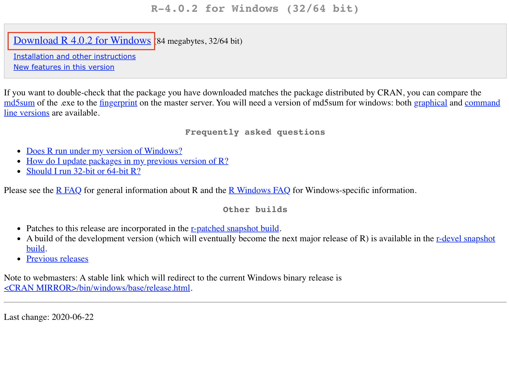
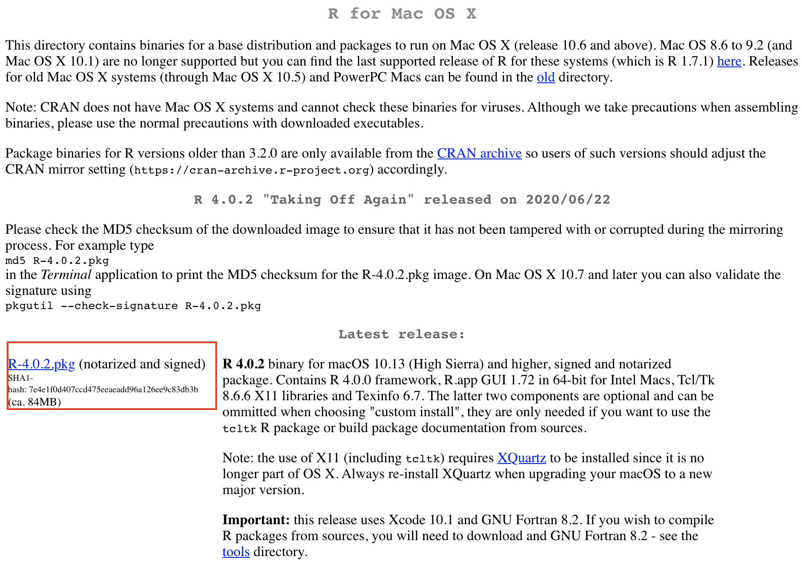
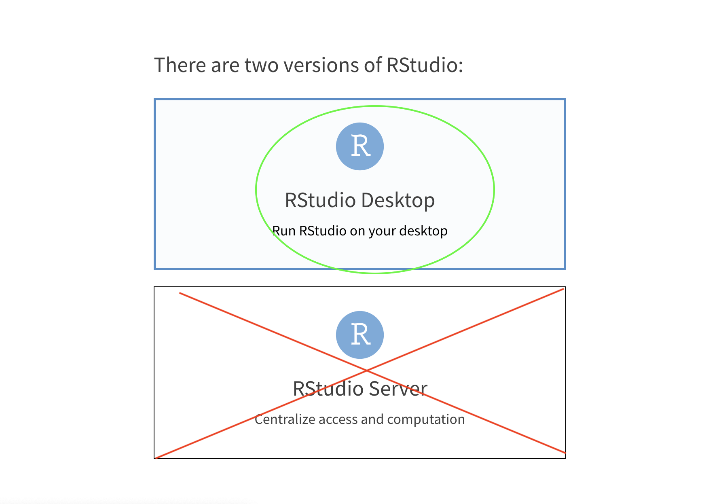
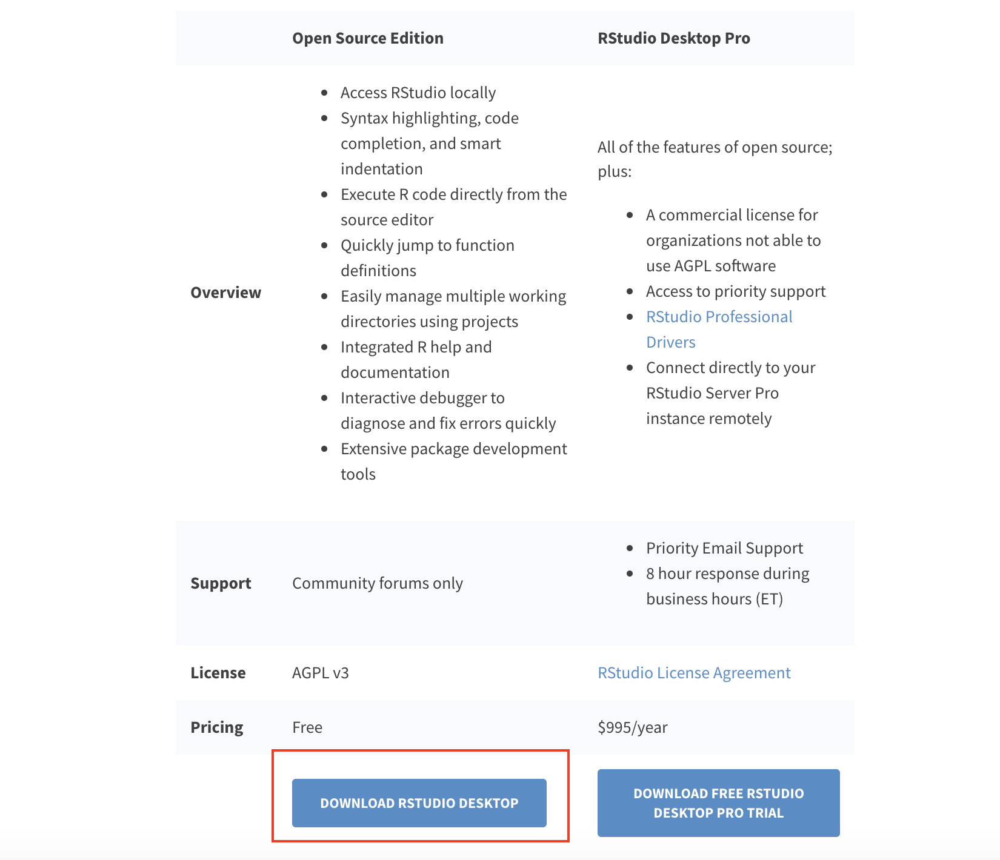
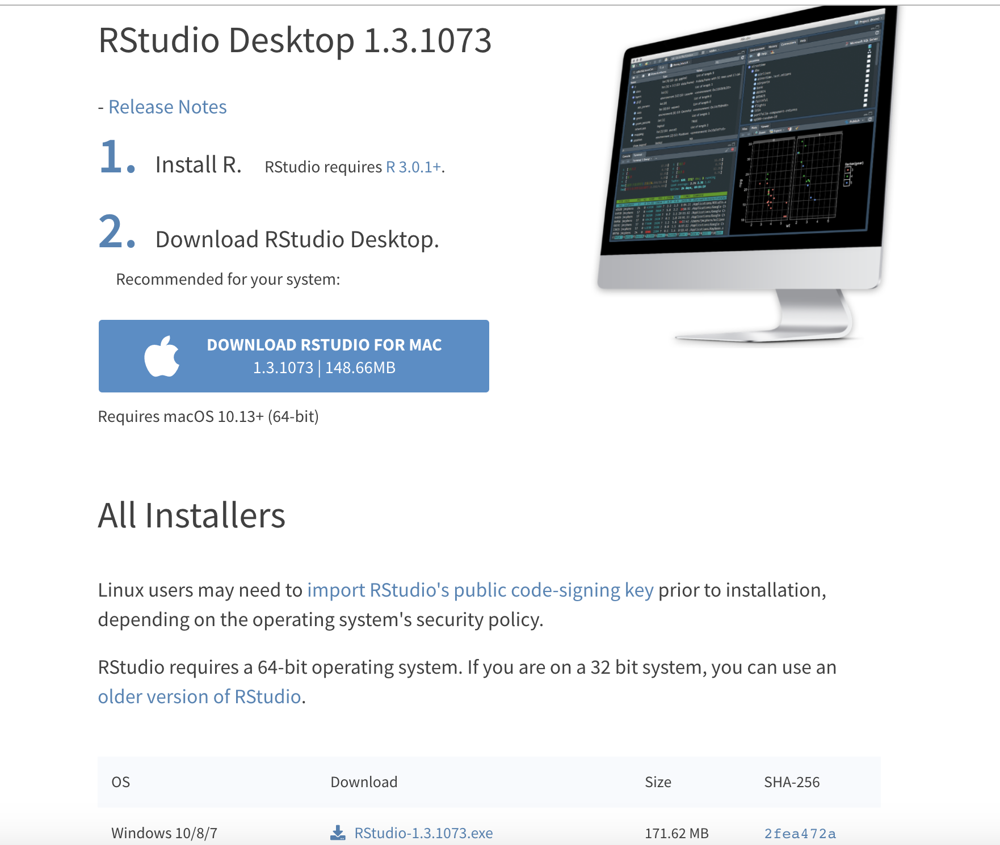
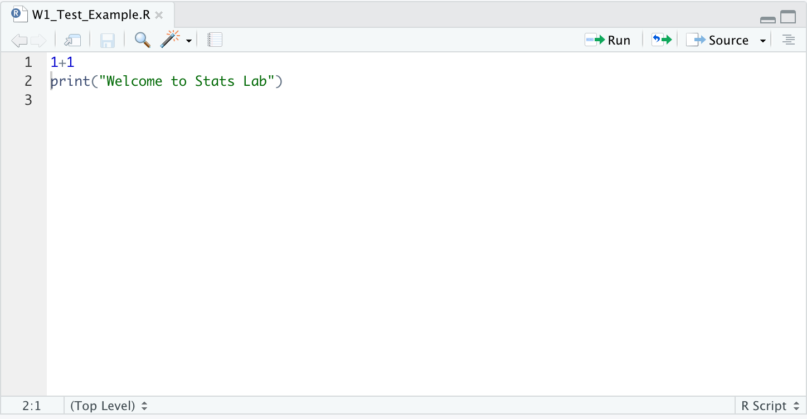

```{r setup, include=FALSE}
knitr::opts_chunk$set(echo = FALSE)
```

## Installing `R` & RStudio
- `R` is a **FREE** statistical programming language and software environment used in a number of fields that require stats and math.
- Incredibly powerful.
- R Studio is an integrated development environment used to make `R` more intuitive and to facilitate `R` programming.
- In other words - `R` is the programming language, RStudio is the software environment that makes programming in it easier.

## Installing `R`
- First, we need to install `R` itself.
- If on Windows, go to https://cran.r-project.org/bin/windows/base/
- If on Mac, go to https://cran.r-project.org/bin/macosx/

## Downloading `R` On Windows
- Click to download, and follow through installation steps.



## Downloading `R` On Mac
- Click to download, follow through installation steps.



## Installing RStudio
- Next, you will need to download and install RStudio, a software environment for programming in `R`. 
- First, go to https://rstudio.com/ 
- Then click the tabs as demonstrated on these next slides.
  
## Installing RStudio


## Installing RStudio


## Installing RStudio


## Installing RStudio
**DON'T INSTALL RSTUDIO SERVER!**

## Installing RStudio


## Installing RStudio

## Installing RStudio

(Or whatever operating system you are on (e.g. Windows, Linux, Mac, etc.)

## Installing RStudio
- Next, open up the downloaded application, and walk through your computer's install process with RStudio

## Installing RStudio
If all has gone correctly, you should be able to open up a window similar to this one:
- Try testing out simple computations - `R` can be used as a calculator (among many other uses).

