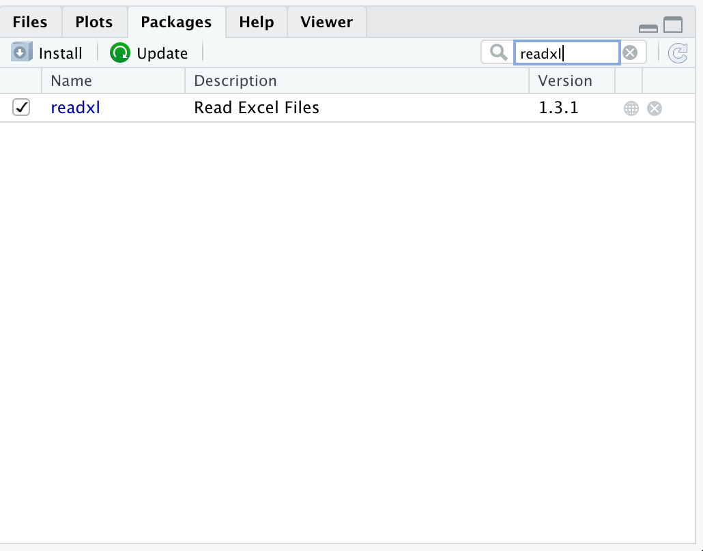
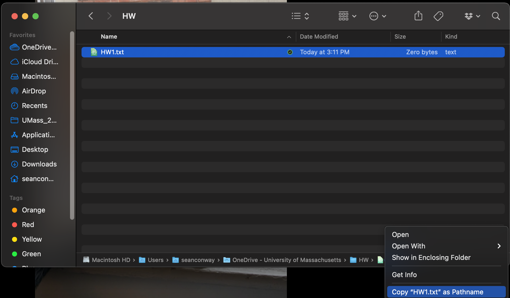
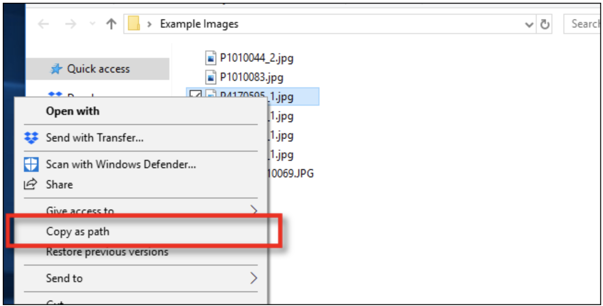
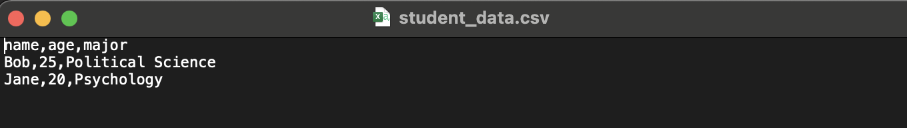
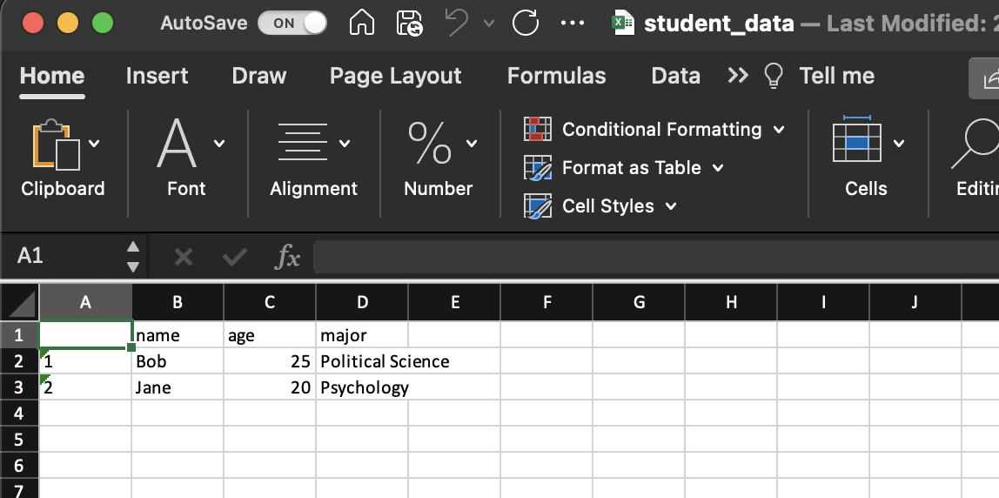

```{r setup, include=FALSE}
knitr::opts_chunk$set(tidy.opts=list(width.cutoff=30,tidy=TRUE))
# libraries
library(tidyverse)
library(readxl)
library(here)
sample_data <- tribble(
  ~ name, ~age, ~major,
  "Bob",  25,  "Political Science",
  "Jane", 20,  "Psychology"
)
```
 
## Introduction
- Today, you will learn how to read in datasets with `R`. By read in, we mean take a data file that exists outside of `R` and import it such that we can analyze it with `R` code.
- When working with data, it often comes in different file formats. While there are more file formats than we can cover in a single slide show, today we will focus on three especially common file types: *.csv*, *.xls/.xlsx*, and *.RData*.

## Getting Started
- Before we get started, you will need to make sure you have two packages installed on your computer: `readr` and `readxl`.
- To install these packages, simply run the following code in your RStudio console:
```{r eval=F}
install.packages(list("readr","readxl"))
```

## Getting Started
- If you're unsure whether or not you have these packages, you can navigate over to your packages tab (bottom right panel in RStudio) and search for them.

  
## A little bit about file paths
- Before we actually read in the data, we need to talk about file paths.
- A file path is the specific location of a file on your computer. You may have seen a file path before.
- If you're on Windows, a full file path will look something like *C:\textbackslash Users\textbackslash Sean\textbackslash Desktop\textbackslash My_Homework\textbackslash Statistics_HW_1.pdf*.
- If you're on Mac, a full file path will look something like */Users/Sean/Desktop/My_Homework/Statistics_HW_1.pdf*

## Home directory
- Your computer's home directory is its "home base", containing a directory of all folders and files for a user. 
- Here's a visual demonstration of a file path, starting from the home directory
- We see this user's home directory (*"Home_Directory"*), which contains the folder *"UMass"*, which contains the folder *"Statistics"*, which contains the file *"HW1.pdf"*.
 

## File paths
- When reading in data, you will need to specify the location of the specific file you are reading in. 
- The easiest way to do so is to copy the exact file path (called the "absolute" path) and paste it into your code.

## Copying a file path on Mac
- On Mac, simply go to the specific file using Finder, select the file, and right click the file image in the lower right hand corner.
- Then, select the *"Copy [file name] as Pathname"* option.
- Then, you will be able to paste the file path into your `R` code.


## Copying a file path on Windows
- Similarly to Mac, Windows users can simply find the file they need using File Explorer, select it, right click, and select *"Copy as path"*^[Image Source: https://www.howtogeek.com/670447/how-to-copy-the-full-path-of-a-file-on-windows-10/]


## Tabular Data
- Now that we're ready to go, let's talk a little about tabular data.
- Tabular data is simply data made up of rows and columns. Here is an example of a tabular dataset:
```{r echo=F}
knitr::kable(sample_data)
```

## Tabular Data
```{r echo=F}
knitr::kable(sample_data)
```
- Here we have a dataset with 2 rows and 3 columns (we don't include the first row in our count because this row only contains our column names). The column names denote **variables**, while the data in the rows contains individual values on these variables.
- This dataset contains data about two college students. Specifically, each student's *name*, *age*, and *major*. 
- We call this dataset *tidy* because each row is a single observation (i.e., a single student), and each column is a single variable.

## Comma-Separated Value (.csv) Files
- A comma-separated value file (.csv) is a data file where a comma separates one value from another. 
- Here's our student data, stored as a .csv file:
 
- Note that it looks *very* similar to the format we saw earlier, only now columns (rather than lines) separate the values.
  
## Reading in .csv files
- While `R` has a base `read.csv()` command, we will use the function `read_csv()` from the `readr` package.
- Reading in our file is fairly simple. All we need to do is specify the file location (or **path**) on our computer with `file`, and save the result to a new object in `R` using `<-`.
```{r echo=F, message=F}
# students don't need to see this, it will only confuse them
student_data <- read_csv(here::here("Reading_in_data","data","student_data.csv"))
```

## Reading in .csv files
<!--this doesn't read the data in, but we want them to think it does--> 
```{r eval=F}
student_data <- read_csv(file="data/student_data.csv")
```
  
Now we have a nice `tibble` (a special type of `dataframe`), which we use to store data in R, called `student_data`, containing the dataset we need.
```{r}
student_data
```

## A bit more about `read_csv()`
- `read_csv()` is smart. By default, it assumes that the first row of the file contains our column names, so it automatically names our columns based on that row.
- If by chance the data file does not have column names, you will need to specify `col_names=FALSE` when you run the code. Otherwise, `read_csv()` will name the columns based on the first row of data.
- You can also use the `col_names` argument to provide a character vector of names to give the columns of data (e.g., `col_names=c("col1", "col2"7)`).
- Make sure to save your dataset to an `R` object using `<-`. You can name the data whatever you want, so long as you remember the name.
  
## Microsoft Excel Files
- If you have taken a computer class before, you probably have worked with Microsoft Excel. Excel is a program for storing and working with data. While we will be doing our data analyses in `R`, it's not uncommon to get a data file created with Excel. These files have the extension *.xls* or *.xlsx *.
- Here is our student data again, this time stored as a .xlsx file: 


## Microsoft Excel Files

- Notice that Excel decided to give this file row numbers - we will have to keep that in mind when we read the file into `R`, because we don't want `R` to think those numbers represent actual data. We only want the data from cell *B1* to cell *D3*.

## Microsoft Excel Files
- Sometimes you may need to open the .xlsx/.xls file before reading it in, in order to see what you're working with. 
- You don't need Microsoft Excel installed on your computer to open one of these files (most computers come with free software that can open them), but if you would like it installed, UMass does offer Microsoft 365 at no cost to students - see <https://www.umass.edu/it/software/microsoft-office-365-education> for more info.

## Reading in .xls/.xlsx
- We can use the `read_excel()` function from the `readxl` package to read in our .xls or .xlsx file, specifying the file with the `path` argument.
- We will also use `read_excel()`'s `range` argument to only read in data from cell *B1* to cell *D3*.
```{r echo=F}
# actual data read-in but we won't show them this
student_data <- read_excel(here("Reading_in_data","data","student_data.xlsx"),range="B1:D3")
```
```{r eval=F}
student_data <- read_excel(path="data/student_data.xlsx",
                           range="B1:D3")
```
```{r}
student_data
```
  
## Loading `.RData`
- Sometimes, an `R` user has saved their data as `.RData`, the file type specific to `R`. 
- While this data can only be opened with `R`, reading it in is not complicated at all.
- Simply use the `load()` command (while specifying the file path), and you can load the data into your R environment.
- **DO NOT** attempt to assign it to a new `R` object, as this will only assign the *name* of your data, not the data itself, to the object.
```{r, echo=F}
load(file=here("Reading_in_data","data","student_data.RData"))
```
```{r, eval=F}
load("data/student_data.RData")
```
  
## Loading `.RData`
- And there our data is again!
- Note that the data will have whatever object name was given to it, when it was originally saved to a `.RData` file.
```{r}
student_data
```

## `.RData`
- It's rare to find archival data (e.g., on data.gov) in a `.RData` file format.
- However, it's fairly common to work with a collaborator who saves their data in this format after performing some data cleaning operations on a raw dataset.
- If you do wish to save data as `.RData`, you can use R's `save()` command, making sure to specify both the `R` object you wish to save, and the name of the file you will save it as (also make sure to end the file name with a ".RData" extension.)
  
## Conclusion
- You've now learned how to read in data with a `.csv`, `.xls`/`.xlsx`, and `.RData` file format.
- There are many more file types out there, but these are just a few common formats.
